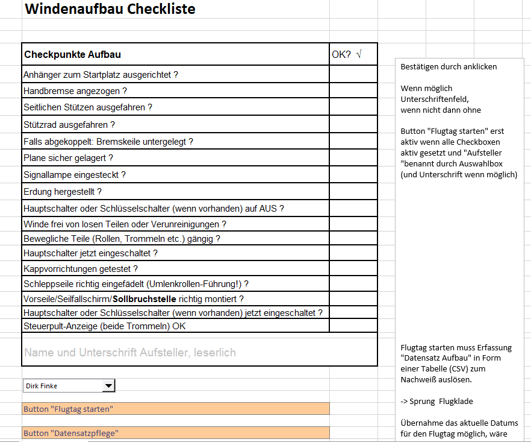
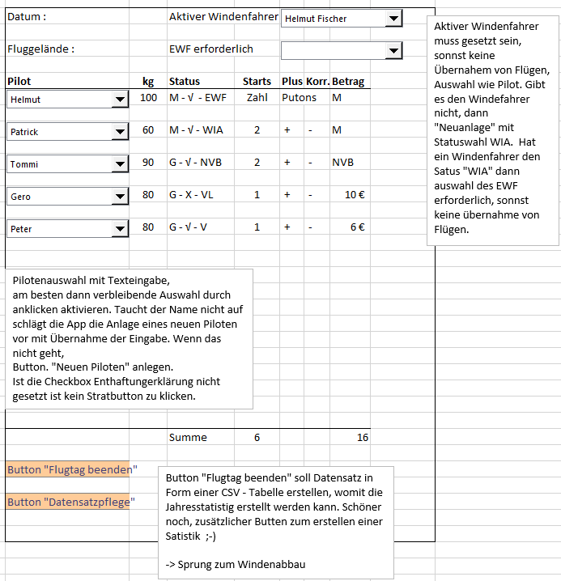
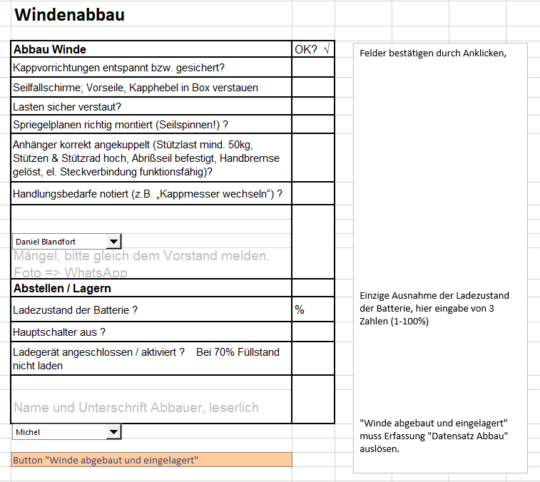
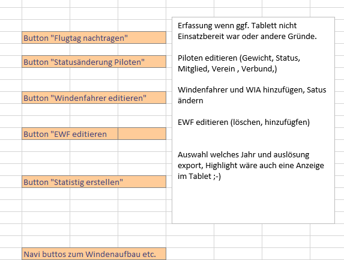

# winden-proto
A prototype app to administering tow winch operation for paragliders

# Models

## Winde

### Kerndaten

* ID
* Name
* Baujahr
* Status 

### Aufbau-Protokoll

List

### Abbau-Protokoll

List

## Pilot

* Name: Text
* Gewicht: 
* Status: List EWF, WF, WIA, MG (default?), NVB, G, INACTIV
* Verein: Text
* Enthaftungserklärung: Bool

## Schlepp

* Datum
* Winde
* Windenfahrer
* EWF
* Pilot
* Status: List started (default), finished, canceled
* SchleppStart
* StatusDate

# Running the app

# Storyboard

# Ideas 

Use [aiohttp demos](https://github.com/aio-libs/aiohttp-demos/tree/master/demos/polls)
